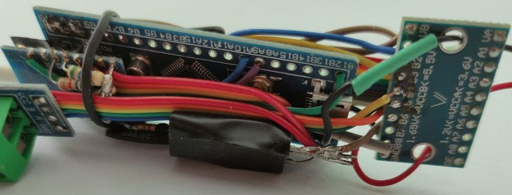
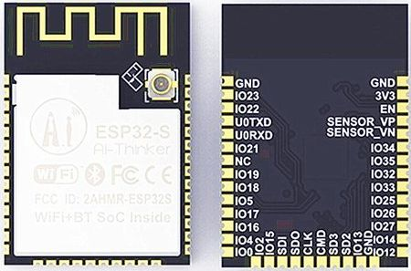

It started as a simple home automation project. I was looking for a way to do the most basic things like track temperature/humidity, switch the lights, open water valve in the greenhouse, turn on the fan when it gets too hot, etc. So I looked into some ready-made automation kits and... decided to have some fun building my own! 
The idea was to set up WiFi-capable devices all over the place (luckily, my WiFi coverage allows that) and wire them to the switches/relays/sensors etc.
My first try was Raspberry PI + USB relay module, driven by a python script. Works well for one or two locations, but if you want a dozen - it is an overkill and gets pricey.
The next thing I tried was STM32 ("Blue Pill") module wired to ESP8266. STM32 is great to read multiple sensors and control several devices, but doesn't have any networking features. ESP8266 is a WiFi chip, but has a very limited number of I/O ports. Together they make a great combo, but there are cons. For example, I had to maintain 2 different firmwares, implement a protocol for the chips to talk to each other, put up with reliability issues because all connections were manually soldered and looked like this:

Another thing is the amount of available RAM/flash, that is pretty restrictive on both chips.

Finally, I found this beautiful ESP32 module that had everything I could ever think of, and more - in a single tiny module, for a very competitive price (N.B.: no, I'm not paid to advertise ESP32, nor am I affiliated with Espressif in any way. I was just truly fascinated by the chip). 

Now I could easily connect 5 different sensors, 2 relays, 2 H-bridges, several LEDs and a buzzer, and make it all accessible over WiFi! The last missing piece of the puzzle was the software. At first, Arduino seemed like a very natural choice. There's support for ESP32, you get access to all the modules that mostly work well, the community is great, learning is easy, and it is a de-facto standard for simple MCU projects.
But... there's a flipside:
* Arduino is too unified. It attempts to cover all sorts of MCUs, with different goals, features, hardware capabilities and design principles. What if I need access to hardware-specific features of ESP32, that aren't available, let's say, in STM32? ESP32 has its own development platform ([ESP-IDF](//docs.espressif.com/projects/esp-idf/en/latest/esp32/index.html)), and if you really want to get the most of the hardware, you have to use ESP-IDF. The problem is, Arduino went its own way. It accesses *some* of the hardware directly, bypassing the ESP-IDF. It runs startup code to initialize Arduino-specific features, which was not desirable in my case. It uses pre-configured (and, possibly, patched) version of ESP-IDF, and if you want to re-configure it for your particular needs (which is a common practice for ESP-IDF application), you're in for another challenge. So what happens if I want to use Arduino and ESP-IDF at the same time, without dirty hacks and workarounds? Seems like mission impossible, but no. There's a wonderful [PlatformIO](//platformio.org/platforms/espressif32), that's not only a better alternative to Arduino's native IDE, but also allows to use Arduino as a library, on top of ESP-IDF! Now this should be the *Ultimate Solution*, I thought... and faced another handful of issues.
* Arduino wasn't designed for multitasking. No, it is perfectly possible to do multitasking in Arduino, there are scheduling libraries that offer pseudo-multitasking, and if there's native MCU support (which is the case for double-core ESP32) - you can always call native functions directly. At the same time, most of the Arduino libraries don't expect to be run in a multitasking environment, they don't care about synchronization, locking and race conditions, so one has to either patch the source, or apply various hacks to achieve stable performance. One example would be the [OneWire library](//github.com/PaulStoffregen/OneWire). This is a well-designed and mature library that works perfectly on AVR, STM32 (and I would expect, on other single-core MCUs in a single-thread mode). OneWire protocol depends on proper timing, so the library disables interrupts when sending/receiving data packets, with the naive belief that interrupts are the only possible cause of inaccurate time measurements and prolonged delays. Wrong! ESP32 context switches must be disabled as well, or the code must be re-designed to allow for a context switch to occur safely at the very moment when the protocol expects to see state change on the 1WIRE bus. As a result, this library fails consistently on ESP32 with multiple running tasks. For me, only about 30% of the measurements were successful and the rest were failing. The workaround was suggested and implemented by [Chuck Todd](//github.com/stickbreaker) in [his fork of OneWire library](//github.com/stickbreaker/OneWire). It is pretty straightforward - disable context switches for the duration of 1WIRE reads/writes, and voila, it works! But what about the rest of the tasks? Now they can't run until 1WIRE has finished its business... Far, far from perfect, IMHO.
* As I mentioned above, Arduino sometimes accesses the hardware directly, by reading/writing memory-mapped registers and ports. ESP-IDF does the same. So for the most of common stuff like writing to the serial port, we have 2 similar blocks of code that need to be included in the resulting binary, unnecessarily bloating its size.
* Using Arduino as a library together with ESP-IDF requires some (heavy - i think) modifications of both cores. Given that this is a community effort, there's a (substantial) time lag to see new ESP-IDF releases ported to PlatformIO's way of using it together with Arduino. For me, this was the last drop and I made a tough decision in favor of ESP-IDF alone, dropping Arduino completely, and never regretted it.

I don't know about you, but if I read this far, I would be puzzled. Multitasking? Concerns about firmware size? Just to switch a relay or get a temperature reading? The OP must be going nuts! Actually, that could be the case. After a couple of successful ESP32-driven projects, I got greedy. I wanted to see more and more features, and, the most important, I was not constrained by Arduino any longer. Here's what I wanted to achieve:
* True multitasking, so I could poll for a sensor in a simple loop and not worry about blocking other tasks.
* Modular architecture - a simple `#include <XXX>` followed by a call to `useXXX(...);` should be enough to make use of an external device attached to ESP32.
* Extensible design - adding new devices (or porting from Arduino) should be easy.
* Unified communication protocol to speak to the outer world - whether to get a sensor reading, or to send a control command to switch a relay - via different communication channels (serial port, MQTT, HTTP, WebSockets, etc). Human-readable. JSON-based.
* Unified logic for loading, using and storing module-specific settings. Human-readable. JSON-based.
* Unified asynchronous event dispatching system to tie different modules together, while reducing dependencies between the modules to a minimum.
* Over-the-air firmware updates with few simple clicks or unattended - when new firmware becomes available on the server.
* Logging with configurable appenders, for example, to save error logs to the flash memory and retrieve it when needed, or to send the log messages instantly to rsyslog server over UDP - very useful feature for debugging new code without physical access to the chip and/or it's UART0.
* Get sensor readings into [influxdb](//www.influxdata.com/) time series database via MQTT and [Telegraf](//www.influxdata.com/time-series-platform/telegraf/) and visualize it with [Chronograf](//www.influxdata.com/time-series-platform/chronograf/), or any other time-series database/UI.
* Allow to configure multiple WiFi APs and select optimal/available one automatically.
* If no WiFi SSID/password was pre-configured in the firmware, or no connection could be made within configured time frame, launch AP with captive portal, allowing to connect from any smartphone and configure WiFi options.
* Comprehensive Web-based User Interface (yes, I'm that crazy)!
    * Single page [ReactJS](//reactjs.org) - based app.
    * WebSockets to read/write state and settings of the running firmware and control attached devices.
    * Modular design - follows backend modules.
    * Served directly from the ESP32's IP address over WiFi, with an option to be served from a different server (to save flash space, for instance)
    * Displays general system/runtime info, such as RAM/flash usage/fragmentation, uptime, WiFi connection details, per-task info, 
    * Allows to control pin modes from UI (switch between digital/ADC/DAC/PWM/...), read/write pin state, voltage, PWM duty/freq., etc.
    * Allows to scan popular buses for connected devices (I2C and MODBUS - get connected devices' addresses, 1WIRE - get codes of connected devices).
* All of the above - in the reusable library, with only the needed code to be included into the binary for a particular project.
* Must fit in the 2MB (actually, a little less) to make OTA updates possible on a standard ESP32 dev module with 4MB SPI Flash.
* Supervisor app:
    * Controls multiple devices via WebSockets API.
    * Provides simple higher-level scripting API with something as simple as Javascript, to run custom scenarios (for example, if the rain is detected by device A, tell device B to close the window).
    * Notifications to [Telegram](//t.me) channel or any other messenger.
    * No central server - I don't want to pay for a VPS, domain a static IP. Rather, I want to have it on a couple of Raspberries (behind the NAT, dynamic IP) and make it accessible from any part of the world. [TOR hidden services](//www.torproject.org/docs/tor-onion-service) is one way to make it work.

Looking back, it's been about 6 months of part-time engagement, and most of the above (except the supervisor app) was implemented to a (not perfect, but) usable extent. I have 11  setups, driving different devices and feeding sensor data into the Influx server running on a Raspberry. Most of the boards have had an uptime of > 30 days (the rest have hardware issues due to manual soldering, caught by WDTs causing auto-reboot every now and then). 

So I thought maybe there are other crazy guys and girls like me out there, who enjoy this stuff as much, and decided to share the source/docs. It may help enthusiasts to build something alike, to learn the MCU or just to have fun! :-)