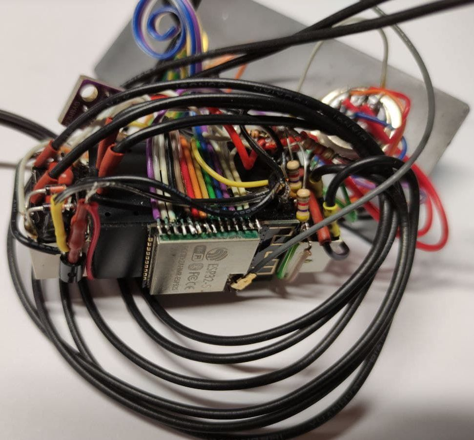

No, I'm not talking WiFi or Bluetooth. I just want to get rid of this clew of wires:

so I designed a couple of PCB's that should cover most of my use cases, and ordered them at [JLCPCB](https://jlcpcb.com/):

Nice, huh?
That's 3D rendering, they didn't arrive yet. We'll see how good they actually are in a couple of weeks.