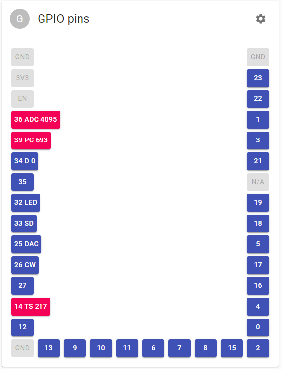
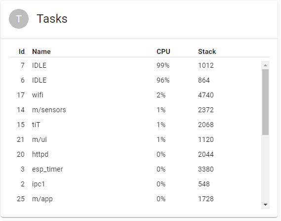
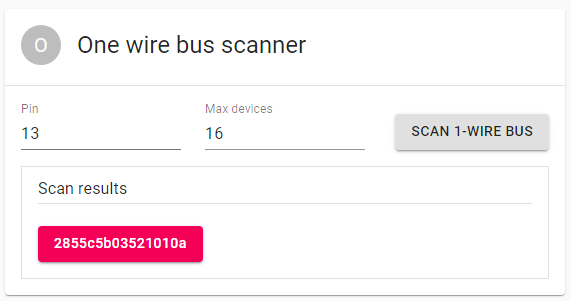
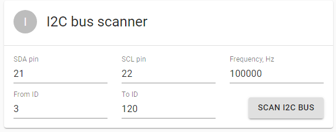
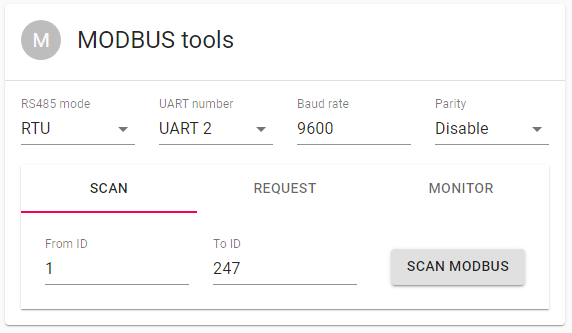

# Components

## Logger

What's wrong with ESP_IDF [Logging library](//docs.espressif.com/projects/esp-idf/en/latest/esp32/api-reference/system/log.html)? Nothing at all. It is great if you don't mind to have console terminal attached to UART0 when you debug your application. However, if you want to test new version of your app on a remotely installed MCU, without access to the serial port, an ability to redirect logs to a some server on your LAN, or at least a way to save the logs to flash memory for later examination, could be of tremendous help. This is where our logging library comes into play. It follows the de-facto standard architecture of multiple configurable loggers, connected to multiple configurable appenders. Our logger is able to intercept log messages from various ESP-IDF modules and redirect them to the designated appenders.

### Appenders

The following appenders are currently implemented:

- console appender, simply sends all output to UART0, just like the ESP-IDF logger does.
  Console appender is added by default. If you don't want to add it - unset `CONFIG_ESP32M_LOG_CONSOLE` in your `sdkconfig`.

- UDP appender, sends log messages to **rsyslog** server or any other UDP endpoint, either in **rsyslog** format, or in plain text.
  UDP appender can be added using `CONFIG_ESP32M_LOG_UDP` in `sdkconfig`, or in the code:

```cpp
#include <esp32m/log/udp.hpp>
...
log::addBufferedAppender(new log::Udp());
```

refer to [Remote logging tutiorial](/docs/tutorial/remote-logging) for more information on setting up a **rsyslog** server. If you want to send messages in plain text:

```cpp
auto udp_appender=new log::Udp("your.udp.server.name or IP", udp_port);
udp_appender->setMode(log::Udp::Format::Text);
log::addBufferedAppender(udp_appender);
```

- MQTT appender, sends the messages to MQTT broker:

```cpp
#include <esp32m/log/mqtt.hpp>
...
log::addBufferedAppender(log::Mqtt::instance());
```

refer to [Remote logging tutiorial](/docs/tutorial/remote-logging) for more information on setting up a **MQTT** server.

- VFS appender - saves log messages to a file.

```cpp
#include <esp32m/log/vfs.hpp>
...
log::addBufferedAppender(new log::Vfs("/spiffs/log-file.txt"));
```

- UART appender - the same as _console appender_, but can output to UART2 or UART1.

```cpp
#include <esp32m/log/uart.hpp>
...
log::addAppender(new log::Uart(2));
```

You can add as many appenders as you need.

`void addBufferedAppender()` accounts for appenders that may need some time to initialize, before they are able to accept messages (for example, connect to a network server, mount filesystem, etc.). It checks if the appender is ready, and if not - saves the messages to a temporary buffer. Once the appender is fully initialized, the contents of the buffer is automatically forwarded to the appender, and the buffer is released.

### Intercepting output

There are two methods to redirect messages to our logger:

- `void log::hookEsp32Logger(bool install=true)` - uses [esp_log_set_vprintf()](https://docs.espressif.com/projects/esp-idf/en/latest/esp32/api-reference/system/log.html#_CPPv419esp_log_set_vprintf14vprintf_like_t) to redirect ESP-IDF log output. This interception is turned on by default and can be disabled by unsetting `CONFIG_ESP32M_LOG_HOOK_ESPIDF` in your `sdkconfig`
- `void log::hookUartLogger(int bufsize = 128);` - intercepts all output to UART0 via ESP32 ROM function. This is useful if you want to redirect messages that don't use ESP-IDF logging library. This is off by default, but can be turned on with `CONFIG_ESP32M_LOG_HOOK_UART` in `sdkconfig`

You can use either method, or both at the same time, depending on your needs. However, there are cases these methods cannot handle. For example, direct writes to ESP32 memory-mapped I/O registers cannot be intercepted and redirected. ESP-IDF panic handler and some other error handlers do that, unfortunately.

### Optimizing performance

If you have time-critical tasks that may suffer from additional delays introduced by network/vfs I/O, it is possible to decouple logging from the actual output.
`void log::useQueue(int size=1024)` adds a buffering layer, that allows the calling thread to proceed immediately, without blocking, and actual I/O will take place in another thread. The default size of the buffer is 1024 bytes, may be changed by passing the second parameter to the call.

## Event manager

Event manager is at the heart of **esp32m**, it facilitates asynchronous communication between the tasks inside the **esp32m** application, as well as interaction with the outer world via the API.

Event manager implements publish-subscribe mechanism, passing events from publishers to the interested parties (subscribers).

Event manager is represented by a singleton instance of `EventManager` class that has only two methods:

- `void publish(Event &event)` - publishes the event;
- `const Subscription *subscribe(Subscription::Callback cb)` - adds calback to the list of event recipients. Un-subscribing is possible by deleting the returned `Subscription` instance.

`Event` is the base class for events, it defines the base property of all events - event type. The rest of the specific properties and methods should be defined in the descendant classes that represent specific events.

One example is a `Request` event used by the API, see [this](/docs/reference/api) for more information.

## Application container

`esp32m` application is a collection of modules. Every module is a descendant of `AppObject` class and has access to the following features:

### Event handling

Every module instance is by default subscribed to all the events, that are passed to `virtual bool AppObject::handleEvent(Event &ev);` method. The method should return `false` if the `Event` was not handled, and `true` otherwise. The default implementation does nothing and returns `false`.

### State management

A module can take advantage of built-in state management workflow by overriding the following methods:

```cpp
virtual void setState(const JsonVariantConst state, DynamicJsonDocument **result);
virtual DynamicJsonDocument *getState(const JsonVariantConst args);
```

These state get/set requests may originate from the UI and/or the [API](/docs/reference/api). The state is communicated via JsonVariant container, allowing arbitrary JSON-formatted data to be passed to/from the module.

If the module allows its state to be changed by UI or API requests, it must override `setState()` method and change its internal state according to the `state` parameter. If the module wants to respond to the state change request with aditional information (for example, indicate invalid state change request, communicate warnings, etc.) it may create new instance of `DynamicJsonDocument`, populate it with the corresponding details and return via the `result` parameter. `esp32m` will automatically delete the `result` when it is no longer needed.

### Configuration

`esp32m` features global configuration store (/spiffs/config.json by default). The store is a JSON object where each item is named after the module and contains module-specific configuration details. On startup, `esp32m` reads configuration store and passes config details to the corresponding module. When a module knows its configuration has changed, it triggers `EventConfigChanged` event that instructs `esp32m` to request updated configuration and save it to the store.

A module can paricipate in this mechanism by overriding the foloowing methods:

```cpp
virtual bool setConfig(const JsonVariantConst cfg,DynamicJsonDocument** result);
virtual DynamicJsonDocument* getConfig(const JsonVariantConst args);
```

The methods are very similar to the `getState() / setState()` methods (see above).

### Logging

Every `AppObject` implements `log::Loggable` interface providing access to the module-specific logger.
It is advised to use pre-defined `logX` macros inside module methods, where X is one of E, W, I, D or V (Error, Warning, Info, Debug, Verbose). For example:

```cpp
#include <esp32m/logging.hpp>
...
void MyModule::DoIt() {
    if (cannotDoIt)
        logE("could not do the job due to %s", errormsg);
    else
        logI("the job will be done");
}
```

## Sensor monitoring

A `Device` class is a descendant of `AppObject` that extends its functionality to poll device-specific sensors periodically and make sensor readings available over MQTT or by other means.
Extend `Device` class and override its `virtual void pollSensors();` method that will be called periodically (typically once per second). Inside that method, call `sensor()` methods with the name of the sensor and its current reading.

```cpp
void sensor(const char *sensor, const float value);
void sensor(const char *sensor, const float value, const JsonObjectConst props);
```

The second method allows to pass additional properties along with the reading, to further refine queries to the time series database.

`pollSensors()` method is called from a single dedicated thread, therefore it is safe to access global resources from `pollSensors()` without additional synchronization (provided that these resources are not accessed by other threads, of course). This dedicated thread calls `pollSensors()` of every device sequentially. Therefore, it is recommended to avoid unnecessary delays in `pollSensors()`. If sgnificant time is required for a device to perform a reading, it is advised to move lengthy operations to separate threads.

## Input / Output

### GPIO

ESP32 Manager introduces abstraction layer for I/O pins that serves 3 major puropses:

- synchronize access to pins to prevent multiple tasks from racing with each other when accessing a pin at the same time;
- access various i/o extenders (such as CD74HC4067) seamlessly, via a unified interface;
- provides information about pin's features, state, mode, hardware capabilities and interfaces it supports (such as ADC, PWM, pulse counter, etc.) at runtime.

`io::IPin` class describes an abstract digital pin and its hardware features.
This example shows how to get an `io::IPin` instance for any ESP32 I/O port:

```cpp
#include <esp32m/io/pins.hpp>
#include <esp32m/io/gpio.hpp>
...
auto pin32=gpio::pin(GPIO_NUM_32);
```

This is how to obtain `io::IPin` instance for any pin of PCF8575 I2C extender:

```cpp
...
#include <esp32m/io/pins.hpp>
#include <esp32m/io/pcf857x.hpp>

auto pcf = io::usePcf8575(0x20);
auto pcfPin1 = pcf->pin(1);
```

### I2C

ESP32 Manager features `I2C` class with thread-safe methods to access I2C bus from multiple threads. `I2C` instance facilitates communication with a device at given I2C address. It provides synchronization features to access single device from multiple threads.

This is how to initialize `I2C` instance with board default `SDA`/`SCL` pins:

```cpp
...
#include <esp32m/bus/scanner/i2c.hpp>

useI2C();
```

If you want to initialize `I2C` instance with custom `SDA`/`SCL` pins:

```cpp
...
#include <esp32m/bus/i2c.hpp>

auto i2c_dev = new I2C(<device_address>, I2C_NUM_0, <SDA>, <SCL>);

// Now you can pass this instance to a device for example:
// new dev::Bme280(i2c_dev, "BME280");
```

### 1Wire

One-Wire driver is based on David Antliff's [esp32-owb](//github.com/DavidAntliff/esp32-owb) component and uses [RMT](//docs.espressif.com/projects/esp-idf/en/latest/esp32/api-reference/peripherals/rmt.html) for reliable operation. One-Wire protocol is used mainly by DS18B20 and similar temperature sensors.

### Modbus

Modbus driver allows to communicate with slave MODBUS devices over RS-485 transceiver connected to serial port, usually UART2.

## Network

### Wifi

WiFi component peforms the following functions:

- manages connection lifecycle, finding available Access Points and making sure the connection is maintained at all times, reconnecting if necessary;
- if no connection could be established, launches Access Point named after the application name, with Captive Portal to configure AP credentials manually;
- synchronizes ESP32 time with NTP server (if Internet connection is available);
- preserves configured APs to auto-connnect on the next boot;
- provides information about Station and AP state to the UI and the API;
- allows to scan for available Access Points from the UI or API.

Using WiFi component is simple:

```cpp
#include <esp32m/net/wifi.hpp>

...

net::wifi::useWiFi();
```

If you would like to provide SSID/password in your app:

```cpp
net::wifi::addAccessPoint("SSID", "password");
```

In the UI:

```typescript
import { startUi, Wifi } from "@esp32m/ui";

...

startUi({ plugins: [WiFi] });
```

### Captive portal

Captive portal functionality is included in the core Wifi module and there are no extra steps needed to make it work. If no WiFi connection could be established, Wifi module will automatically switch ESP32 to AP+STA mode and will launch captive portal that should open the Web page allowing to connect to one of the available APs. Unfortunately, there is no well-defined standard for the Captive portal and some devices may not understand the request to open a web page upon connecting to ESP32 AP. In this case, simply open [http://192.168.4.1](http://192.168.4.1) on your smartphone or tablet after connecting to the AP.

Additional steps are needed to include Captive portal in the UI:

```typescript
import { startUi, CaptivePortal } from "@esp32m/ui";

startUi({ plugins: [CaptivePortal] });
```

### Mqtt

MQTT component manages connection to MQTT server, reconnects if necessary, provides API channel to control `esp32m` application via [MQTT API](/docs/reference/api#mqtt) and forwards sensor readings to the time-series database.
[This tutorial](/docs/tutorial/mqtt) provides more information.

### [Over-the-air updates](/docs/tutorial/ota)

## Debugging

### GPIO

GPIO debugger allows to control the mode of ESP32 I/O pins and change/monitor their state. GPIO debugger supports most of the ESP32 hardware features:

- digital I/O with configurable pull-ups/pull-downs;
- Analog-to-Digital Converter (ADC) with configurable attenuation;
- Digital-to-Analog Converter (DAC) with configurable output voltage;
- Pulse Counter with configurable noise filter, triggering edges and increment/decrement modes;
- PWM generator (LEDC) with configurable duty cycle and frequency;
- Sigma/Delta generator with configurable prescale and duty;
- Cosine Wave generator with configurable amplitude, phase shift and frequency;
- Touch Sensor with configurable threshold and charge/discharge speed.

Usage:

```cpp
#include <esp32m/debug/pins.hpp>

...

debug::usePins();
```

In the UI:

```typescript
import { startUi, DebugPins } from "@esp32m/ui";

...

startUi({ plugins: [DebugPins] });
```



### Tasks

This component is a read-only task manager that shows running tasks and their properties:

- task ID;
- task name;
- CPU usage;
- stack high watermark.

CPU usage may help determine tasks abusing the CPU. Stack high watermark shows the amount of stack space that has never been used by the task. This value may be used to optimise task stack size passed to [xTaskCreate](//docs.espressif.com/projects/esp-idf/en/latest/esp32/api-reference/system/freertos.html#_CPPv411xTaskCreate14TaskFunction_tPCKcK8uint32_tPCv11UBaseType_tPC12TaskHandle_t). If the value is close to 0, it means that stack size for this task should be increased, otherwise the task risks running out of stack space. If the value is too big, it makes sense to decrease stack size to prevent memory wasting.

Usage:

```cpp
#include <esp32m/debug/tasks.hpp>

...

debug::useTasks();
```

In the UI:

```typescript
import { startUi, DebugTasks } from "@esp32m/ui";

...

startUi({ plugins: [DebugTasks] });
```



### Bus scanners

Bus scanners are useful if you don't know the address of the device(s) connected to a bus. These components allow to detect addresses of all connected devices in the UI.

#### 1-Wire bus scanner

Scans One-Wire bus for all connected devices and shows their addresses.

Usage:

```cpp
#include <esp32m/bus/scanner/owb.hpp>

...

bus::scanner::useOwb();
```

In the UI:

```typescript
import { startUi, OwbScanner } from "@esp32m/ui";

...

startUi({ plugins: [OwbScanner] });
```



#### I2C bus scanner

Scans I2C bus for all connected devices and shows their addresses.

Usage:

```cpp
#include <esp32m/bus/scanner/i2c.hpp>

...

bus::scanner::useI2C();
```

In the UI:

```typescript
import { startUi, I2CScanner } from "@esp32m/ui";

...

startUi({ plugins: [I2CScanner] });
```



#### Modbus scanner

Scans RS485 bus for all connected MODBUS devices and shows their addresses.
This component provides some additional tools to communicate via MODBUS device.

Usage:

```cpp
#include <esp32m/bus/scanner/modbus.hpp>

...

bus::scanner::useModbus();
```

In the UI:

```typescript
import { startUi, ModbusScanner } from "@esp32m/ui";

...

startUi({ plugins: [ModbusScanner] });
```



### Diagnostic LED

This component is used to quickly determine the state of the MCU and diagnose possible issues using a single LED.
The LED communicates the state of critical components by a number of flashes that correspond to a state code for a component.
A component that wants to use this feature defines fixed number of state codes in the 1..255 range (it is better to keep it under 10).
We recommend to use the following codes:

- 1 - the component works normally;
- 2 - 4 - the component is in the intermediate state (in the process of performing an operation that is going to result in success or failure, for example, connecting to server);
- 4 - 6 - the component is experiencing a temporary failure and is going to try again soon;
- 7 and above - the component failed permanently.
  When the state change occurs, the component fires `event::Diag` event with the ID and the state code. The ID is a `uint8_t` and must be unique across the components using this feature. The ID also defines the order of the component in the process of communication.

For example,

Usage:

```cpp
#include <esp32m/debug/sysled.hpp>

...

debug::useSysled();
```

This example assumes LED is connected to IO2. If you use different pin - just pass it to `debug::useSysled()`.
