# Devices

ESP32 Manager supports limited number of peripheral devices out-of-the-box. If you want to connect device that is not currently supported, you have the following options:

- let us know about it by opening an issue on github;
- port available source code yourself (should be not too difficult);
- write driver from scratch using device datasheet.

It may be possible to integrate Arduino-based device drivers by adding esp32m-arduino bridge to the ESP32 Manager. There's conceptual understanding of how to make it possible, but we need to see if there's any demand.

## Relay

The following relay types are supported:

- controlled by a single digital pin (usually SPDT relays);
- controlled by 2 digital pins (usually latching relays).

The driver also supports relay state detection:

- using one extra digital pin that changes state when relay turns on/off;
- using 2 extra digital pins, the first pin reports ON state, the second - OFF state;
- no extra state pins - works for relays controlled by a single digital pin.

### Usage

```cpp
#include <esp32m/io/gpio.hpp>
#include <esp32m/dev/relay.hpp>

...

// single digital pin controlled relay, 0-off, 1-on
dev::useRelay("my-relay", gpio::pin(GPIO_NUM_XX));

// latching relay controlled by 2 pins
// note that it is impossible to reliably detect relay state in this case
dev::useRelay("my-latching-relay", gpio::pin(GPIO_NUM_XX), gpio::pin(GPIO_NUM_XY));

// latching relay controlled by 2 pins
// pin ZZ reports relay state
useRelay("my-latching-relay", gpio::pin(GPIO_NUM_XX), gpio::pin(GPIO_NUM_XY), gpio::pin(GPIO_NUM_ZZ), gpio::pin(GPIO_NUM_ZZ));

// latching relay controlled by 2 pins
// pins ZX and ZY report relay state
useRelay("my-latching-relay", gpio::pin(GPIO_NUM_XX), gpio::pin(GPIO_NUM_XY), gpio::pin(GPIO_NUM_ZX), gpio::pin(GPIO_NUM_ZY));
```

By default it is assumed that HIGH signal turns the relay ON, and LOW signal turns it OFF. State pins (if used) have different assumption - LOW means ON and HIGH means OFF.
If you want to change that, use `void Relay::setOnLevel(Pin pin, bool level)` method. For example, if a NO/NC relay turns on via LOW level:

```cpp
auto relay=useRelay("my-relay", gpio::pin(GPIO_NUM_XX));
relay->setOnLevel(Relay::Pin::On, false);
```

By default, the state of the relay is preserved across reboots, i.e. if the relay was initially OFF, you turned it ON via API or UI, and powered down or restarted the MCU, ESP32 Manager will turn the relay ON during the next boot. This behavior may be changed by `void Relay::setPersistent(bool p)` method.

In the UI:

```typescript
import { use, Relay } from "@esp32m/ui";

...

use(Relay([["my-relay", "Relay Descriptive Name"],["my-latching-relay", "Relay Descriptive Name 2"]]));
```

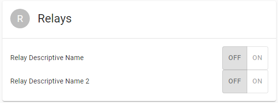

### API

#### Turn on / off

```json
Request:
{"type":"request","target":"my-relay","name":"state-set","data":{"state":"on"}}
-- or --
{"type":"request","target":"my-relay","name":"state-set","data":{"state":"off"}}

Response:
{"type":"response","source":"my-relay","name":"state-set","data":null}
```

#### Get state

```json
Request:
{"type":"request","target":"my-relay","name":"state-get"}

Response:
{"type":"response","source":"my-relay","name":"state-get","data":{"state":"on"}}
-- or --
{"type":"response","source":"my-relay","name":"state-get","data":{"state":"off"}}
-- or --
{"type":"response","source":"my-relay","name":"state-get","data":{"state":"unknown"}}
```

## H-Bridge

This works with L9110S, L298N and similar H-bridges to drive DC motors. Two MCU pins are used to control the H-Bridge:

| Pin A | Pin B | Motor mode |
| ----- | ----- | ---------- |
| 0     | 0     | Break      |
| 0     | 1     | Forward    |
| 1     | 0     | Reverse    |
| 1     | 1     | Off        |

Both "Break" and "Off" modes stop the motor, the difference is that some H-Bridges short output pins in "Break" mode to stop it faster.

### Usage

```cpp
#include <esp32m/io/gpio.hpp>
#include <esp32m/dev/hbridge.hpp>

...
dev::useHBridge("m1", gpio::pin(GPIO_NUM_19), gpio::pin(GPIO_NUM_18));
dev::useHBridge("m2", gpio::pin(GPIO_NUM_23), gpio::pin(GPIO_NUM_27));
```

In the UI:

```typescript
import { use, Hbridge } from "@esp32m/ui";

...

use(Hbridge([["m1", "Motor 1"], ["m2", "Motor 2"]]));
```

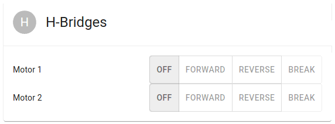

### API

Mode is represented by `integer` with the following values:

```cpp
enum Mode {
    Break=0,
    Forward=1,
    Reverse=2,
    Off=3
};
```

#### Start / stop

```json
Request:
{"type":"request","target":"m1","name":"state-set","data":{"mode":X}}
where X is [0..3] - see above
Response:
{"type":"response","source":"m1","name":"state-set","data":null|error}
```

#### Get state

```json
Request:
{"type":"request","target":"m1","name":"state-get"}

Response:
{"type":"response","source":"m1","name":"state-get","data":{"mode":X}}
where X is [0..3] - see above
```

## Valve

The driver can manage DC motorized ball valves controlled by polarity change (2 control wires), or by connecting (+) power line to open/close channel (3 control wires).
The driver requires 2 additional digital pins to sense valve state (**Pin O** - open sensor, **Pin C** - close sensor):

| Pin O | Pin C | Valve state        |
| ----- | ----- | ------------------ |
| 0     | 0     | Invalid            |
| 0     | 1     | Open               |
| 1     | 0     | Closed             |
| 1     | 1     | Opening or Closing |

The code was tested on the DC motorized ball valves available on [Aliexpress](//aliexpress.com)

### 2 control pins + 2 sense pins

Tested on a valve like this one (CR05 wiring):

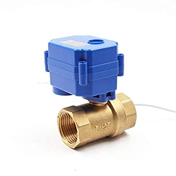 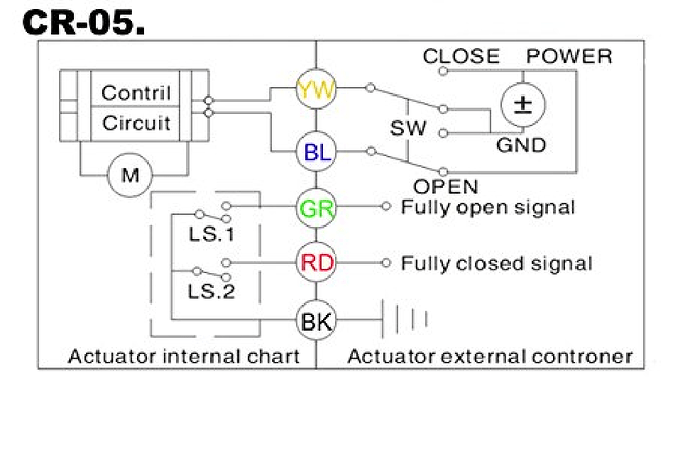

This valve can be connected to ESP32)using an H-Bridge (preferred method) or via 2 SPDT relays:

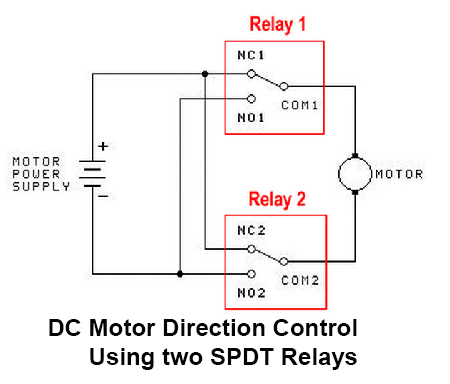

### 3 control pins + 2 sense pins

Tested on a valve like this one (CR702 wiring):

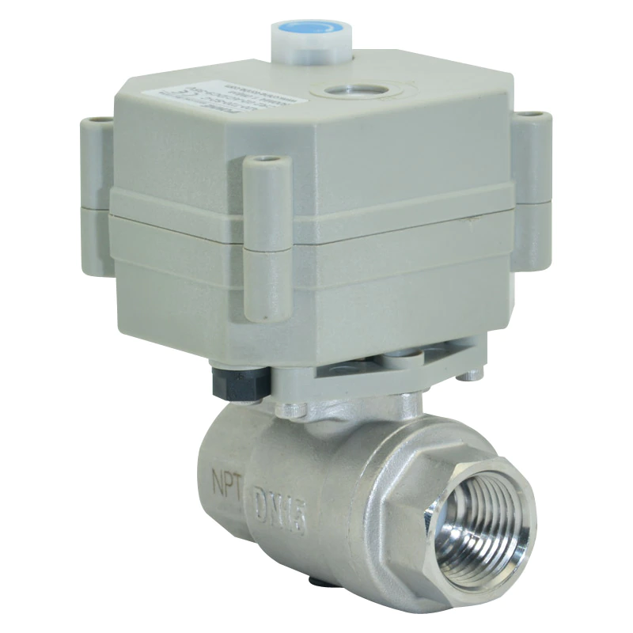 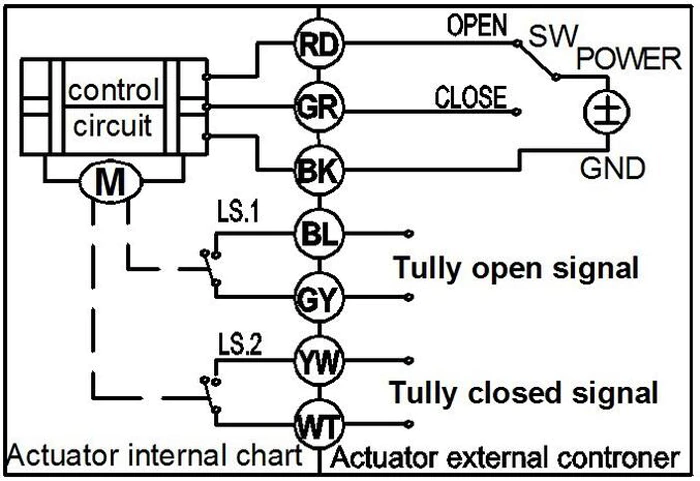

The GY and WT lines are connected to the GND, BL - to Pin O, YW - to Pin C. Two relays (or transistor switches) are used to control the valve:


### Usage

```cpp
#include <esp32m/io/gpio.hpp>
#include <esp32m/dev/hbridge.hpp>
#include <esp32m/dev/valve.hpp>
#include <esp32m/dev/relay.hpp>

// Valve is controlled by H-Bridge
auto mainBridge = dev::useHBridge("main-bridge", gpio::pin(GPIO_NUM_23), gpio::pin(GPIO_NUM_27));
dev::useValve("main", mainBridge, gpio::pin(GPIO_NUM_19), gpio::pin(GPIO_NUM_18));

// Valve is controlled by relays
auto rPow = dev::useRelay("rpow", gpio::pin(GPIO_NUM_32), gpio::pin(GPIO_NUM_33),
          gpio::pin(GPIO_NUM_39), gpio::pin(GPIO_NUM_39));
auto rDir = dev::useRelay("rdir", gpio::pin(GPIO_NUM_25), gpio::pin(GPIO_NUM_26),
          gpio::pin(GPIO_NUM_36), gpio::pin(GPIO_NUM_36));
dev::useValve("garden", rPow, rDir, gpio::pin(GPIO_NUM_23), gpio::pin(GPIO_NUM_27));
```

In the UI:

```typescript
import { use, Valve } from "@esp32m/ui";

...

use(Valve("main", "Water main"));
```

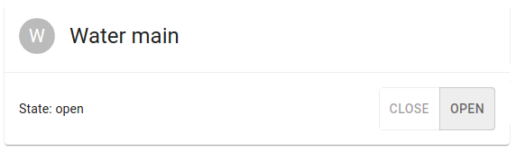

### API

#### Open / close

```json
Request:
{"type":"request","target":"main","name":"state-set","data":{"state":X}}
where X is "open" or "close"
Response:
{"type":"response","source":"main","name":"state-set","data":null|error}
```

#### Get state

```json
Request:
{"type":"request","target":"main","name":"state-get"}

Response:
{"type":"response","source":"main","name":"state-get","data":{"mode":X}}
where X is "unknown", "open", "close", "invalid", "opening", "closing"
```

## Dallas temperature sensor

`esp32m` provides native driver for DS18B20 and similar 1-WIRE temperature sensors. The driver only needs to know the pin connected to DQ (Data) pin of the sensor, it will automatically detect connection mode (normal power or parasite power), number of connected sensors, their addresses and specific model.

```cpp
#include <esp32m/dev/dsts.hpp>

...

dev::useDsts(GPIO_NUM_13);
```

In the UI:

```typescript
import { use, Dsts } from "@esp32m/ui";

...

use(Dsts());
```

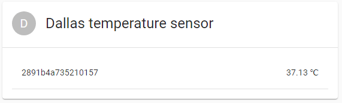

### API

#### Get state

```json
Request:
{"type":"request","target":"dsts","name":"state-get"}

Response:
{"type":"response","source":"dsts","name":"state-get","data":[sensor1,sensor2,...,sensorN]}
```

_sensorX_ is an array of the following elements describing a sensor and its state:

- sensor code (string);
- sensor resoluton, bits (number);
- disabled flag - is automatically set to "true" by the driver if the sensor was detected, but stopped responding for any reason;
- temperature (number) - in &deg;C
- success rate (number) - number of valid responses divided by number of queries - may be used to debug connection issues, interference, etc.

## Buzzer

`esp32m` is able to output sound through passive piezo or magnetic buzzers by sending a signal or series of signals with the specified frequency and duration.

### Usage

```cpp
#include <esp32m/dev/buzzer.hpp>

...

// Buzzer is connected to IO15
dev::useBuzzer(GPIO_NUM_15);
```

In the UI:

```typescript
import { use, Buzzer } from "@esp32m/ui";

...

use(Buzzer());
```

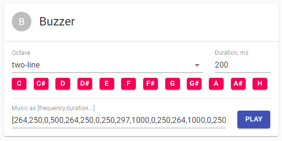

### API

#### Play melody

```json
Request:
{"type":"request","target":"buzzer","name":"play","data":[f1,d1,f2,d2,...,fN,dM]}
Response:
{"type":"response","source":"buzzer","name":"play","data":null|error}
```

**fX** is frequency in Hz, **dX** is duration in ms

## BME280 temperature/humidity/pressure I2C sensor

`esp32m` provides native support for BME/BMP280 sensor connected via I2C bus.

### Usage

```cpp
#include <esp32m/dev/bme280.hpp>

...

// use default I2C address 0x76, or pass it in the first argument if different
dev::useBme280();
```

In the UI:

```typescript
import { use, Bme280 } from "@esp32m/ui";

...

use(Bme280());
```

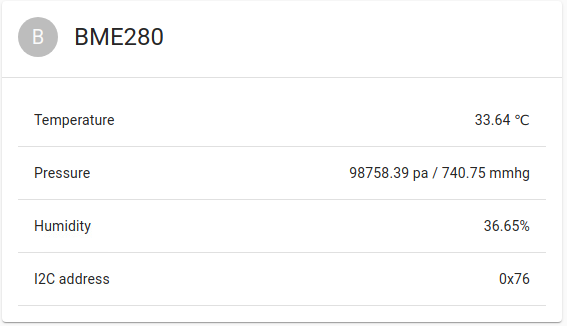

### API

#### Get state

```json
Request:
{"type":"request","target":"BME280","name":"state-get"}
Response:
{"type":"response","source":"BME280","name":"state-get","data":{temperature:T,pressure:P,humidity:H}}
```

## FC-37 rain sensor

FC-37 is a simple resistive rain sensor with digital and analog output. `esp32m` can read analog signal and express it in % corresponding to the rainfall.

### Usage

```cpp
#include <esp32m/io/gpio.hpp>
#include <esp32m/dev/fc37.hpp>

...

dev::useFc37(gpio::pin(GPIO_NUM_33));
```

In the UI:

```typescript
import { use, Fc37 } from "@esp32m/ui";

...

use(Fc37());
```


### API

#### Get state

```json
Request:
{"type":"request","target":"FC-37","name":"state-get"}
Response:
{"type":"response","source":"FC-37","name":"state-get","data":[t,v]}
```

- **t** is the time elapsed since the last successful reading (ms);
- **v** is the coefficient between 0 and 1, where 0 stands for no rain, and 1 stands for maximum possible rainfall.

## Flow meter

`esp32m` supports Hall sensor based flow meters for water and other liquids. These meters emit certain number of pulses per passed through amount of liquid. They are available on [Aliexpress](//aliexpress.com) and look like this:

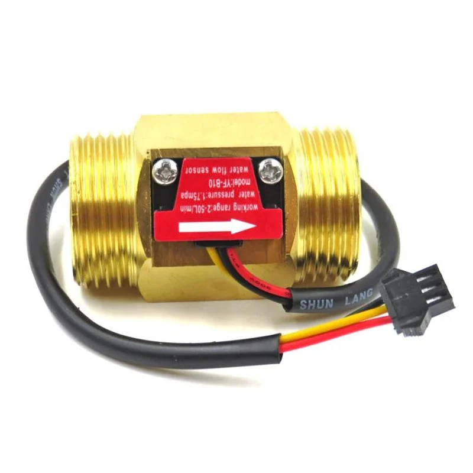

There are different models, for various pipe sizes, and they have different relationship between the flow and the number of pulses, usually a linear equation :

> **F = A \* Q - B**

where

- **F** - number of pulses per second (Hz)
- **Q** - flow rate (l/min)
- **A** and **B** are model-dependent coefficients

Inferring **Q** is simple:

> **Q = ( F + B ) / A**

Usually these devices require 5..15V supply voltage and the maximum output voltage will be higher than what the ESP32 chip can handle on its inputs. Therefore, voltage divider is required to ensure the voltage on the ESP32 pin does not exceed 3.3V. With the 5V supply we use 10KOhm/20KOhm divider.

### Usage

First, find out the **A** and **B** for your model of the flow meter. If your flow meter has a different type of equation - not a problem, as long as you can express **Q** in terms of **F**.

Then, we need to subclass the default implementation of `dev::FlowSensor` and override `virtual float compute(int pc, int ms)` to provide the correct formula for **Q**. In the below example we will assume **A = 4** and
**B = 3**:

```cpp
#include <esp32m/dev/flow.hpp>

class MyFlowSensor : public dev::FlowSensor
{
public:
  MyFlowSensor(const char *name, io::IPin *pin) : dev::FlowSensor(name, pin){};
  float compute(int pc, int ms) override
  {
    if (pc == 0)
      return 0;
    // compute number of pulses per second
    float hz = (float)pc * 1000 / ms;
    // compute flow rate in l/min
    return (hz + 3) / 4
  }
};

...

new MyFlowSensorMain("flow", gpio::pin(GPIO_NUM_4));
```

In the UI:

```typescript
import { use, FlowSensor } from "@esp32m/ui";

...

use(FlowSensor("flow", "Main flow"));
```

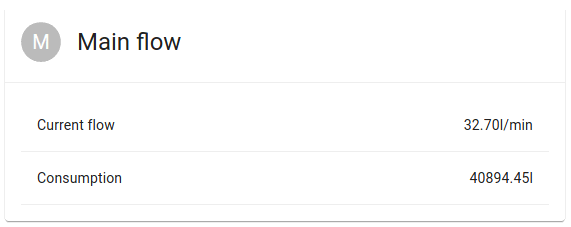

### API

#### Get state

```json
Request:
{"type":"request","target":"flow","name":"state-get"}
Response:
{"type":"response","source":"flow","name":"state-get","data":[t,f,c]}
```

- **t** is the time elapsed since the last successful reading (ms);
- **f** is the current flow rate in l/min;
- **c** is the total volume of liquid passed through the meter, in liters.

## Pressure sensor

`esp32m` supports pressure sensors for gas and liquids that express pressure in terms of voltage. These meters are available on [Aliexpress](//aliexpress.com) and look like this:

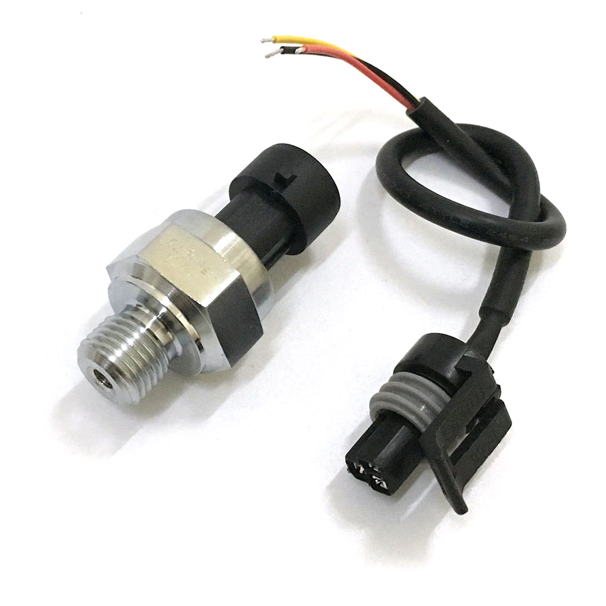

There are different models, and they have different relationship between the pressure and the voltage, usually expressed as a linear equation :

> **Vout = Vcc _ ( A _ P + B )**

where

- **Vout** - output voltage;
- **Vcc** - supplied voltage, usually 5V;
- **P** - pressure in MPa;
- **A** and **B** are model-dependent coefficients.

Inferring **P** is simple:

> **P = ( Vout / Vcc - B ) / A**

Usually these devices require 5V supply voltage and the maximum output voltage is 4.5v, which is too high for the ESP32 chip to handle. According to [this table](https://docs.espressif.com/projects/esp-idf/en/latest/esp32/api-reference/peripherals/adc.html#_CPPv425adc1_config_channel_atten14adc1_channel_t11adc_atten_t), ESP32 can accurately report voltages of up to 2450mV. Therefore, we suggest using 10KOhm/10KOhm voltage divider, which effectively reduces the maximum voltage level by the factor of 2, limiting it to 2.25V.

### Usage

First, find out the **A** and **B** for your model of the pressure sensor. If your sensor has a different type of equation - not a problem, as long as you can express **P** in terms of **V**.

Then, we need to subclass the default implementation of `dev::PressureSensor` and override `virtual float compute(uint32_t mv, float r)` to provide the correct formula for **P**. In the below example we will assume **A = 2/3** and **B = 0.1**:

```cpp
#include <esp32m/dev/pressure.hpp>

class MyPressureSensor : public dev::PressureSensor
{
public:
  MyPressureSensor(const char *name, io::IPin *pin) : dev::MyPressureSensor(name, pin){};
  float compute(uint32_t mv, float r) override
  {
      // assume Vcc is 5V. If you are able to measure it at runtime - provide the value here.
      const float vcc = 5000;
      // compute Vout from the pin voltage that was 2x reduced by the voltage divider
      float vout = mv * 2;
      // compute pressure in MPa
      float pmpa = (vout / vcc - 0.1) * 3 / 2;
      // convert to Atm
      return pmpa < 0 ? 0 : pmpa / 0.101325;
  }
};

...

new MyPressureSensor("pressure", gpio::pin(GPIO_NUM_36));
```

In the UI:

```typescript
import { use, PressureSensor } from "@esp32m/ui";

...

use(PressureSensor("pressure", "Pressure sensor"));
```

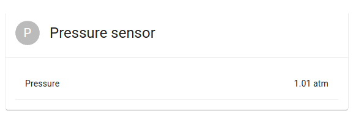

### API

#### Get state

```json
Request:
{"type":"request","target":"pressure","name":"state-get"}
Response:
{"type":"response","source":"pressure","name":"state-get","data":[t,p]}
```

- **t** is the time elapsed since the last successful reading (ms);
- **p** is the pressure in Atm;

## INA series voltage/current sensor

We currently support INA3221 and INA219 sensors. INA266 support is planned, and we will probably combine multiple INAXXX drivers into one, because the protocol is very similar.

### Usage

```cpp
#include <esp32m/dev/ina3221.hpp>

...

dev::useIna3221();
```

In the UI:

```typescript
import { use, Ina3221 } from "@esp32m/ui";

...

use(Ina3221());
```

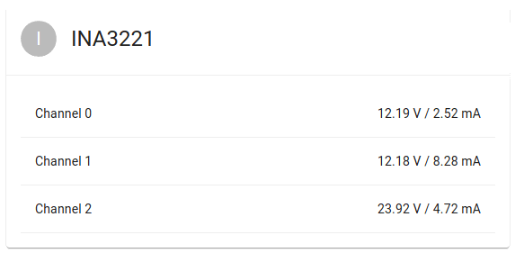

Using INA219 is similar, just replace 3221 with 219 in the example above.

### API

#### Get state

```json
Request:
{"type":"request","target":"INA3221","name":"state-get"}
Response:
{
 "type":"response","source":"INA3221","name":"state-get",
 "data":[addr, channels:[[v1,sv1,c1],[v2,sv2,c2],[v3,sv3,c3]]]
}
```

- **vX** is the channel X bus voltage;
- **svX** is the channel X shunt voltage;
- **cX** is the channel X current.

## DDS238 electricity meter

`esp32m` natively supports this energy meter over MODBUS/RTU protocol:

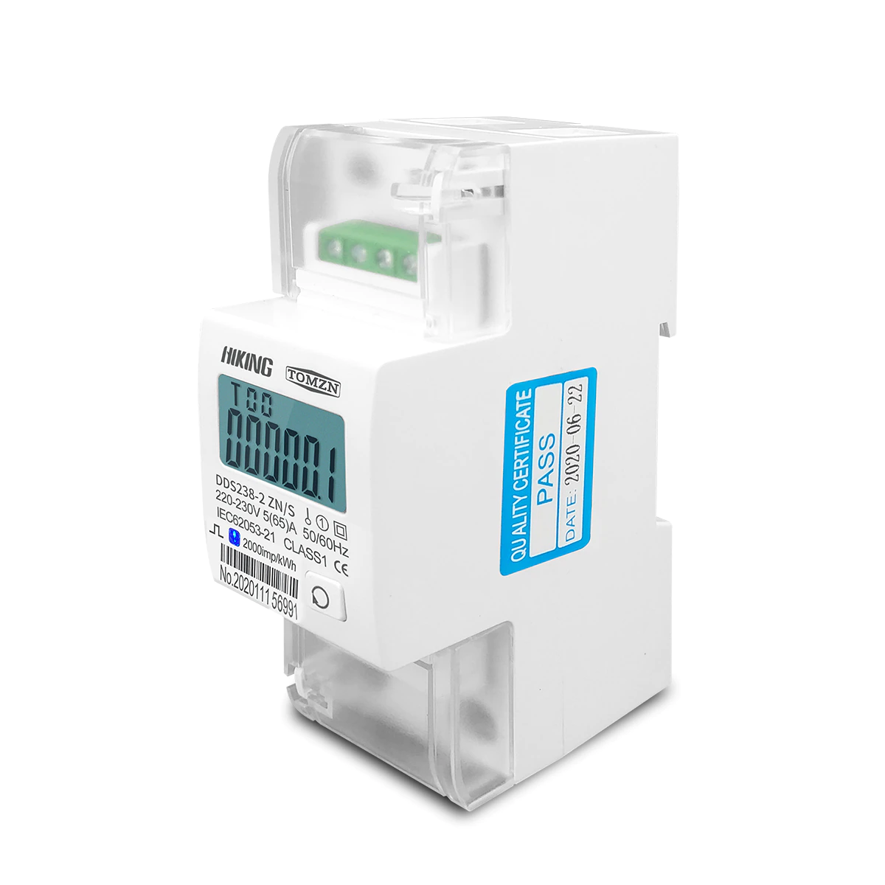

You will need RS485-UART adapter module to connect the meter to ESP32 serial port.

### Usage

This example assumes the RS485 adapter is connected to ESP32's UART2 (IO17 and IO16)

```cpp
#include <esp32m/bus/modbus.hpp>
#include <esp32m/dev/dds238.hpp>

...

modbus::master::configureSerial(2, 9600);
dev::useDds238();
```

In the UI:

```typescript
import { use, Dds238 } from "@esp32m/ui";

...

use(Dds238());
```

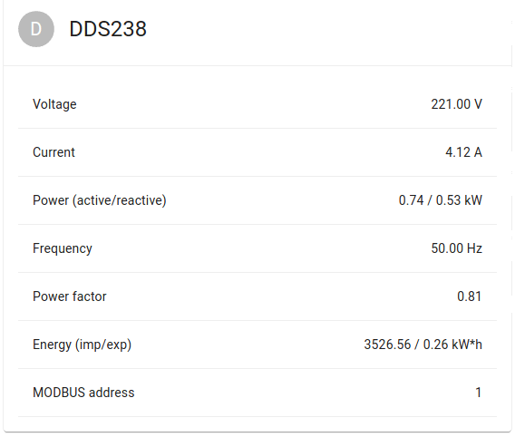
