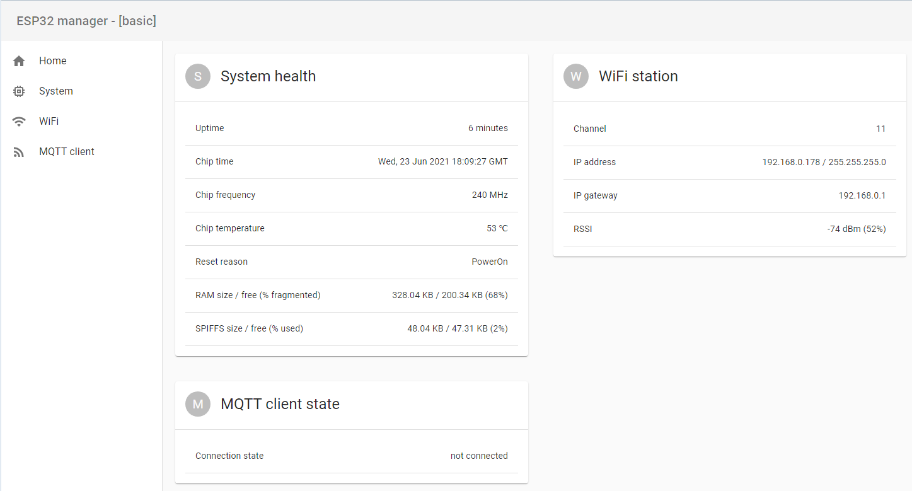

# Quick start

## Requirements
* PC with Windows 10, Linux or MAC OS
* ESP32 module
* Serial programmer


## Prerequisites
You need to have the following software installed:
* [Python 3.x](//www.python.org/downloads/) or more recent.
* [Git 2.x](//git-scm.com/downloads) or more recent.
* [NodeJS 16.x](//nodejs.org/en/) or more recent.
* The latest ESP-IDF, installation instructions are [here](//docs.espressif.com/projects/esp-idf/en/latest/esp32/get-started/index.html). Make sure you follow the first four steps in the aticle, including the `Step 4. Set up the environment variables`. It is not necessary to follow subsequent steps, although you're welcome to do it to make sure your setup is correct and ready for ESP32 Manager.
* [Yarn Classic 1.x](//classic.yarnpkg.com/en/docs/install/#windows-stable) - only needed if you want to use UI.


Initial application upload must be done via serial connection. Depending on the type of your ESP32 board/module, there are different ways to establish serial link to the PC. 
Please review the following guide for details: [Establish Serial Connection with ESP32](//docs.espressif.com/projects/esp-idf/en/latest/esp32/get-started/establish-serial-connection.html).
[This seach](//www.google.com/search?q=esp32+serial+programmer) also yields plenty of relevant guides and tutorials to connect ESP32 module to a PC over serial link.
After the initial upload, subsequent application updates may be performed via OTA and embedded UI from any Web browser.

## Installation

Clone ESP32 Manager core repository:

```shell
$ git clone https://github.com/esp32m/core.git
```

## Compiling and running example

* Go to the `core/examples/basic` folder and open the `main/main.cpp` file in your favorite text editor.
* Find the line `net::wifi::addAccessPoint("SSID", "password");` and replace `SSID` and `password` with yours.
* Connect the ESP32 module/board to the PC.
* Make sure you are in the `core/examples/basic` directory, and run this command:

```shell
$ python ../../esp32m.py --path idf /path/to/esp-idf build flash monitor
```
In most cases it should be able to detect your serial port automatically. If not, just pass it int the command line using the `--port` switch, for example: `--port /dev/ttyUSB0`. 
Within a couple of minutes, you should see something like this in the terminal: 

```
0:00:00:00.0011 I basic  starting 0.0.1
0:00:00:00.0399 D config-vfs  config: {}
0:00:00:00.0429 D config-vfs  XXX bytes loaded
0:00:00:00.0436 I basic  init level 0
0:00:00:00.0548 I wifi  changing mode: AP -> Disabled
0:00:00:00.0553 I wifi  StaInitial -> StaConnecting
0:00:00:00.0556 I basic  initialization complete
0:00:00:00.0556 I wifi  changing mode: Disabled -> STA
0:00:00:00.0558 I wifi  setting STA config
0:00:00:00.0561 I wifi  connecting to SSID [any]...
0:00:00:01.0381 I wifi  device initialized
0:00:00:01.0591 D config-vfs  XXX bytes saved
0:00:00:03.0433 I wifi  my IP: 192.168.0.100
0:00:00:03.0436 I mqtt  connecting to mqtt://mqtt.lan
0:00:00:03.0483 I wifi  StaConnecting -> StaConnected
```

The most important line is `my IP: ....`, it tells us that ESP32 was able to connect to your WiFi router successfully. If not - you will see an error telling you what's wrong.
Note the IP address and open it in your favorite Web browser like this: `http://192.168.0.100`. You should see this page:


