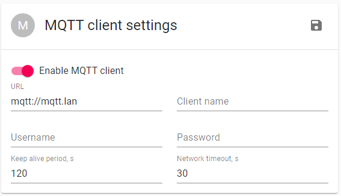
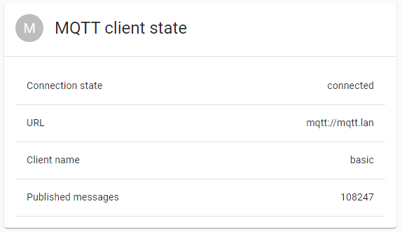

# MQTT setup

[MQTT](//mqtt.org/) is a lightweight and simple publish-subscribe messaging protocol, ideal for IOT devices. `esp32m` makes use of MQTT for many purposes, such as:

- feeding sensor readings into external time-series databases;
- remote logging;
- controlling ESP32 remotely via [MQTT API](/docs/reference/api#mqtt).
  The size of MQTT client in the compiled binary is pretty small (about 50KB), so it is a good idea to include it in your application.

### Server setup

We use [Mosquitto server](//mosquitto.org/), but it is possible to use any other that follows [MQTT protocol](//mqtt.org/). Mosquitto requires zero configuration and works with `esp32m` out-of-the-box.

### Client setup

Add the following code to your `main.cpp` to enable MQTT API:

```cpp
#include <esp32m/net/mqtt.hpp>

...

net::useMqtt();
```

In the UI:

```typescript
import { startUi, Mqtt } from "esp32m/ui";

startUi({ plugins: [Mqtt] });
```

By default, MQTT client module looks for `mqtt.lan` name on your local network. You can just add this name to the `/etc/hosts` file on the machine with the MQTT server, or add static name to your local DNS. Alternatively, you can pass URL of your MQTT server to the `net::useMqtt();` command, it would be something like `mqtt://192.168.0.10`. Another option is to configure MQTT client from within the `esp32m UI`: click on the `MQTT Client` link in the sidebar menu, enter the details and click Save button:



if the connection succeeds, you should see the following box in a couple of seconds:


