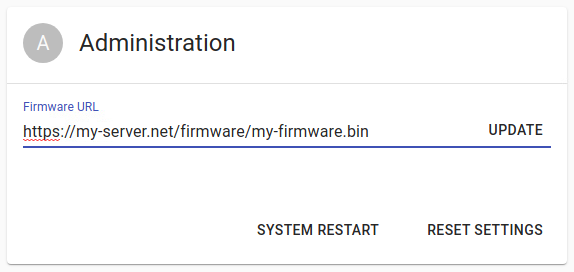

# OTA updates

OTA (Over-The-Air) feature allows to flash new application using WiFi connection, by downloading the application binary from a remote HTTP server.

## Setting up HTTP server

Use any HTTP server of your choice (for example, [Nginx](//www.nginx.com/)). The server must allow binary file downloads, and must be accessible to your ESP32 device either by IP or by DNS name. It is advisable to set up TLS encryption (`https://` protocol), especially if you plan to update application over the Internet, to enforce integrity of your application. One of the easiest way to set up free TLS certificate is by using a [Certbot](//certbot.eff.org/).

## Uploading the application

You can do that by copying the `dist/NAME_OF_YOUR_PROJECT.bin` to the download directory of your HTTP server.

## Setting up the client

OTA module must be included and initialized in your project, like this:

```cpp
#include <esp32m/net/ota.hpp>
```

at the start of your `main.cpp`, and

```cpp
net::useOta();
```

in the `void app_main()`

## Partition table considerations

OTA update process is a native ESP-IDF feature explained in detail in [this article](//docs.espressif.com/projects/esp-idf/en/latest/esp32/api-reference/system/ota.html). In short, ESP-IDF maintains at least two separate slots of the same size in the partition table (ota_0 and ota_1), of which one is currently running application, and the other one is used to download new application. If the download process was successful and all integrity checks were OK, the second partition becomes active, and the first one will accept the
application binary on the next update, and so on. This approach allows to survive incomplete or broken updates, but requires twice as much flash memory. Therefore, only a little less than 2MB of flash remains available for the application. If you want to use OTA with a bigger application, or need flash space for other purposes, consider ESP32 module with 8MB or 16MB flash chip.

## Updating the application

### From the User Interface

Click on the `System` link in the sidebar menu and enter the application URL in the `Administration` box, then click Update:



If the progress bar appears in a few seconds - the update process has started, and must not be interrupted until finished. You will not be able to use the device during the update process. When the update is finished, the MCU will reboot automatically and should become accessible again within a few seconds. If the progress bar doesn't appear for a long time (over 20 seconds), it usually means that the MCU cannot download the application binary for some reason. Check the URL, make sure that you can download application from a browser and check if your firewall blocks the MCU. You can also set up [Remote logging](/docs/tutorial/remote-logging) to check for extended error/warning messages.

### Using the WebSockets API

Establish WebSockets connection with your ESP32 and send this message to start application update:

```json
{
  "type": "request",
  "target": "ota",
  "name": "update",
  "data": { "url": "https://my-server.net/firmware/my-firmware.bin" }
}
```

[See details](/docs/reference/api#websockets) on WebSockets API

### Using the MQTT API

Send the message

```json
{ "url": "https://my-server.net/firmware/my-firmware.bin" }
```

to the target `esp32m/request/project_name/ota/update` (replace `project_name` with the name of your project)

[See details](/docs/reference/api#mqtt) on MQTT API
