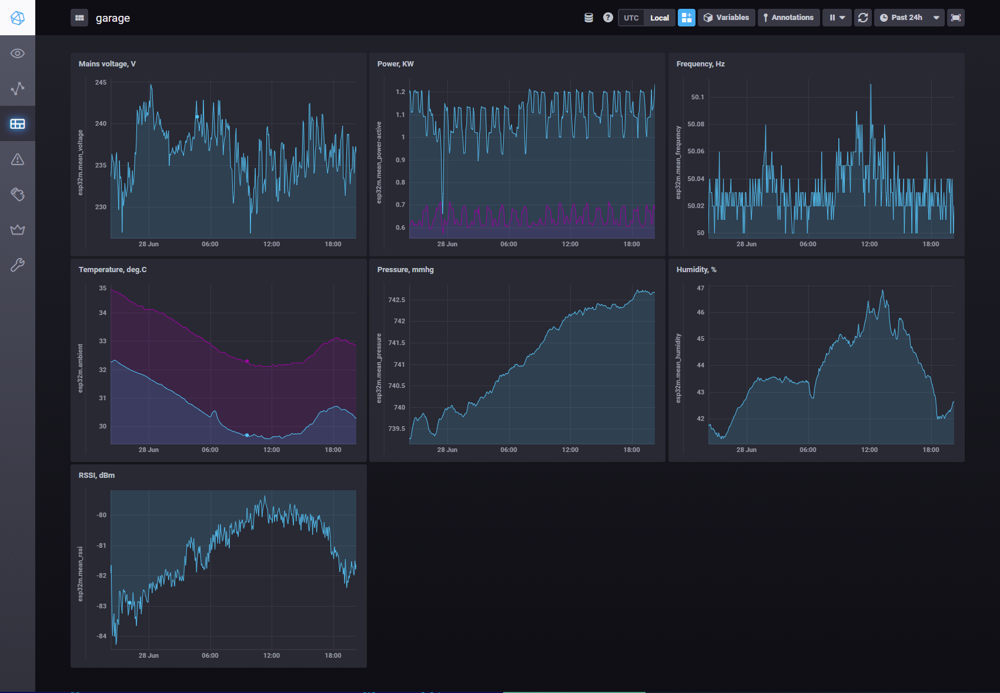

# Monitoring sensors

`esp32m` allows to monitor sensors in real time, and also perform historical analysis by feeding sensor readings into time-series database. 

## Real-time monitoring

### From the UI
Every supported sensor has a corresponding UI module that is available from the Devices menu in the UI. UI widgets request state updates from the backend approximately every second, and you can observe changes on the Web page in real time, for example:


### Using the API

#### MQTT
First, refer to [MQTT setup](/docs/tutorial/mqtt) tutorial page to enable MQTT data feed. Once MQTT connection is established, `esp32m` will start to send sensor readings over MQTT protocol automatically for every connected and configured sensor, approximately every second, in the **influxdb** format, for example:
* **topic**: esp32m/sensor/basic
* **message**: esp32m,unit=basic,device=BME280 temperature=33.64
 
#### WebSockets
Refer to [WebSockets API reference](/docs/reference/api#websockets) for general guidelines. Getting sensor readings via WebSockets is as easy as issuing a `state-get` request, for example:

```json
{"type":"request","target":"BME280","name":"state-get"}
```
`esp32m` responds:

```json
{"type":"response","source":"BME280","name":"state-get","data":{"addr":118,"temperature":33.64,"pressure":98758.39,"humidity":33.65}}
```

## Historical analysis

There are many different tools to store and analyze time-series data that may work with `esp32m`. In this example we will use **Influxdb** with **Chronograph** on a **Debian Stretch** Linux.

* Install [*Mosquitto* server](//mosquitto.org).
* Configure MQTT connection on your ESP32, use [this guide](/docs/tutorial/mqtt).
* Install [**Influxdb**, **Telegraf** and **Chronograph**](//www.influxdata.com/).
* Configure **Telegraf** to subscribe for MQTT messages and feed them into **Influxdb**, in /etc/telegraf.conf
  

Finally, you should see something like this in your browser:

